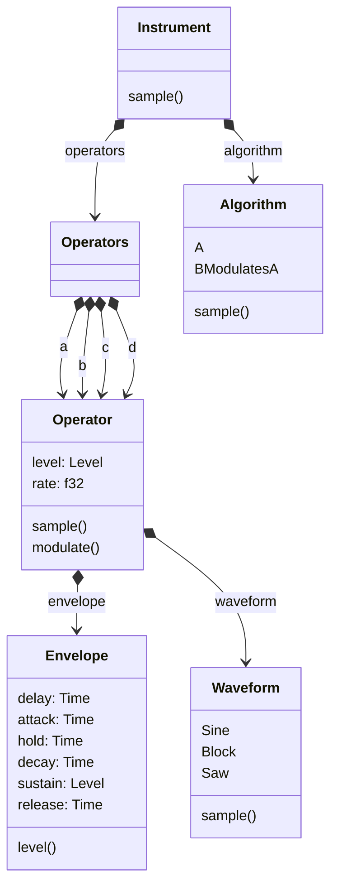

# rs-audio-engine

An experiment to see how FM synthesis works.

The experiment renders a single note to the default audio of your computer.
Due to that this is an experiment it assumes that the audio device handles
float based samples by default. This might not be the case which would
crash.

```
cargo run --example experiment
```

## FM Synthesis

The experiment uses the next structure.

