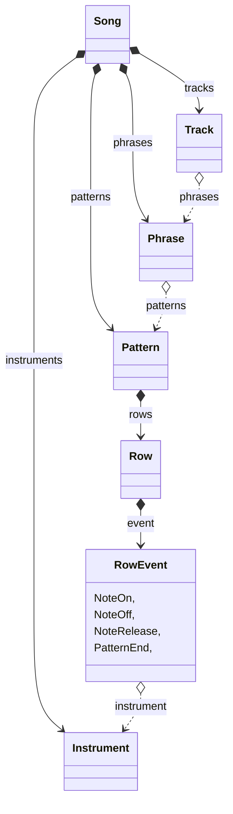
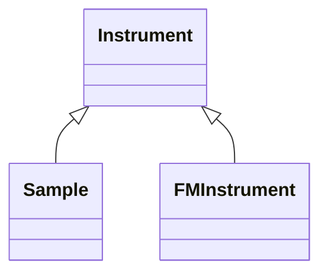
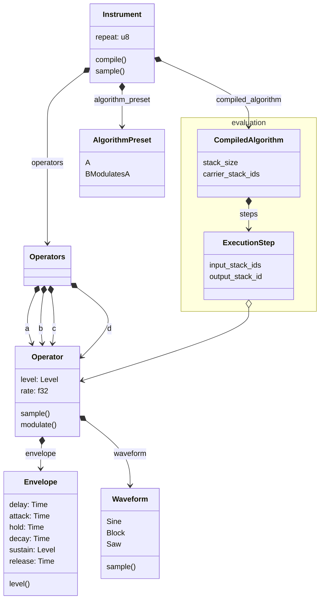
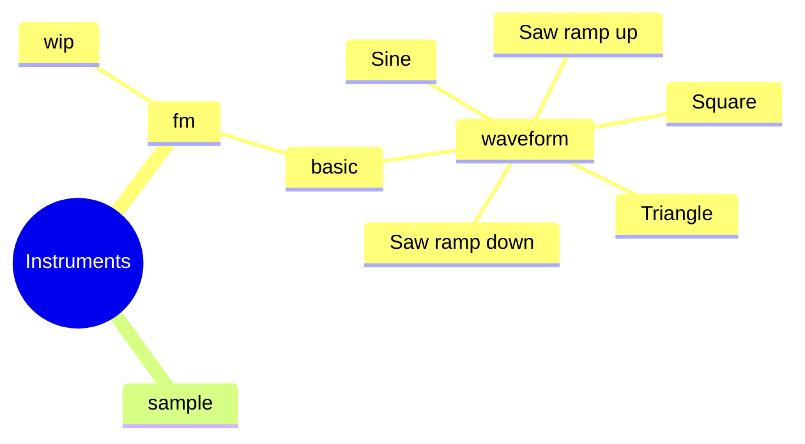

# rs-audio-engine

This all started with an experiment to see how FM synthesis works. Now it
also has a basic DirtyWave M8 inspired tracker and is being extended with
effects and samples as well.

> **DEMO**: For a short demonstration playing a multi track children song.
> ```sh
> cargo run --example song1
> ```
> **NOTE**: Might not work on all platforms as the playback is still a hack

Audio Engine will form the basic audio engine of a game project in development
All steps in making the audio engine will be extensively documented with the
issues that have been solved along the way.

The main idea is to generate the audio track based on some known patterns,
transitions and let the game state also influence the transitions and
allow effects, instruments etc.

Using a tracker would make this easy as the music is already ordered in
a way that can be controlled by an external event. Transitions can
be controlled by allowing track to progress to a certain phrase or jump to
a previous phrase to keep in the same mood.

## Packages and libraries

Audio engine is structured in many packages each of them solve a different
part of making an audio engine. Using traits the implementation is kept as
usage independent.


| Package                          | Description                                   |
|----------------------------------|-----------------------------------------------|
| `audio-engine-common`            | Common datatypes, traits for audio            |
| `audio-engine-notes`             | Notes & Scales based on music theory          |
| `audio-engine-instrument-fm`     | Instrument model for FM Syntesis              |
| `audio-engine-instrument-sample` | Instrument model for tracker sample           |
| `audio-engine-instruments`       | Instrument sound library                      |
| `audio-engine-effect`            | Base data types for effects                   |
| `audio-engine-effect-delay`      | Delay effect processor                        |
| `audio-engine-sequencer`         | Base data types for sound and state tracking  |
| `audio-engine-tracker`           | Dirtywave M8 inspired tracker                 |
| `audio-engine-tracker-songs`     | Song library for tracker                      |
| `audio-engine-export-video`      | Export audio signal to a video (debugging)    |


## Tracker

The library `audio-engine-tracker` implements a basic M8 inspired tracker.
It is still heavily in development and supports the next features

* 8 tracks
* Phrases and Patterns control a single track
* Note On, Note Off and Note Release are used to emulate keyboard/midi events
* Can parse a tracker formatted text to load patterns, phrases and tracks





**TODOs**

* [ ] Requires to render the song to a audio buffer, before playback in a separate step.
  Eventually this should use streaming.
* [ ] Would use the sequencer for mixing audio, global effects, polyphony, and a common
  interface for the player.

## Instruments

The definition of an instrument is kept abstract. Anything that can produce
sound at a certain pitch, supports note on and note off time events can be
used as an instrument.

The different instruments are organized in instrument models. At this time
we have an instrument model for FM synthesis and there is a tracker/sample
based instrument in the making.



To keep track of the 'note state' of an instrument each instrument model
also has an note state structure that can store the some data to continue
when the next sample is requested. For simplicity these note states are
not added to the class diagrams on this page.


### FM Synthesis

The experiment renders a single note to the default audio of your computer.
Due to that this is an experiment it assumes that the audio device handles
float based samples by default. This might not be the case which would
crash.

```
cargo run --example experiment
```

> See `audio-engine-instrument-fm` folder

The experiment uses the next logical structure.



### Sample Instrument

Next to the FM instrument model there is also a sample instrument model in
the making that inspired by s3m instrument samples. Other instrument models
can be added later as well.

### Instrument library

There is also an instrument library (`audio-engine-instruments`) that collects
instruments created in a sound library that can be easily loaded into as a
tracker instrument.



`instruments.fm.wip` is the instrument that is currently under development
When the idea is set to can be moved to an actual location in the instrument
library.

`instruments.sample` is currently unused, but when the sample instrument model if developed
it will also be populated with some instruments.

Loading an instrument from the library

```rust
use audio_engine_instruments::InstrumentLibrary;
let instrument = InstrumentLibrary::FmBasicWaveformSine::create();
```
To receive a sample from the instrument use the `Sound` trait

```rust
use audio_engine_common::digital_sound::Sound;
let sample_rate = 44100.0;
let note_pitch = 437.0;

let mut sound_state = instrument.init_sound_state();
let sample = instrument.sample(0.0, None, note_pitch, sample_rate, &mut sound_state);
```

## Effects (short term development)

Effects are components that can change an audio signal. Being this abstract
allows us to add effects in any level desired. Most likely some instrument
models have their own effects and each track can have its own set of effects

Effects will be organized in their own package for simplicity.
For performance reasons effects will work on buffers.
There is a special ring buffer data type that is often used in audio.

Some type of effects are:

* Delay
* Chorus
* Phaser
* Distortion


## Future Ideas

* Add effects like delay, chorus, phaser, distortion
* Add sound to fm instrument converter